# Fraud Detection Project

The goal of this project is to find a way to detect car insurance frauds using, in addition to some more standard features, a score of the entities obtained with a network analysis of the parties involved in a car accident.

Car insurance frauds detection is very important in the insurance business: their correct detection translates directly into money savings. Unfortunately to do so is often required a careful audit of the claims, in this sense having a reliable automated system capable of highlighting the most suspicious-looking claims may lead to an optimization of the auditing process and ultimately to an economic gain.

## EDA

I've started my project collecting some data about claims filed to an insurance company between 2010 and 2017:

- whether the insured car has a black box on it and if said box was active when the accident happened
- whether the black box detected a crash
- date in which the claim has been filed
- car accident's date
- policy start and end date
- province of the accident
- claim profile, meaning a categorization of the type of accident
- number of vehicles and people involved
- initial outgoing money provision

I used as target variable the score the company gives to a claim, a number between 0 and 100 where 0 indicates a claim which is not likely to be a fraud

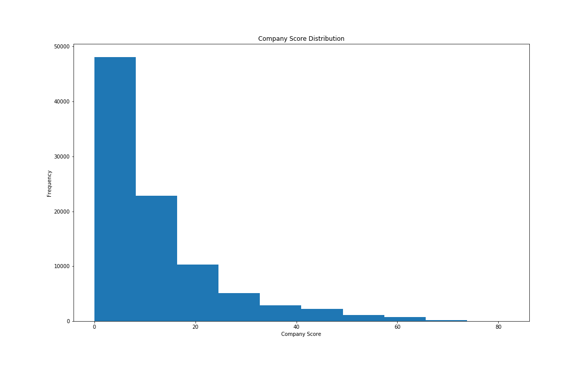

and I looked at the difference in fraud percentage among the values of the various features

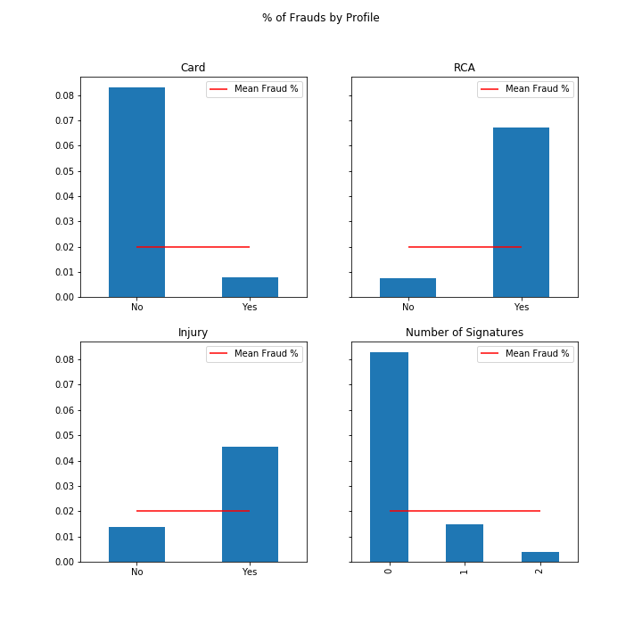

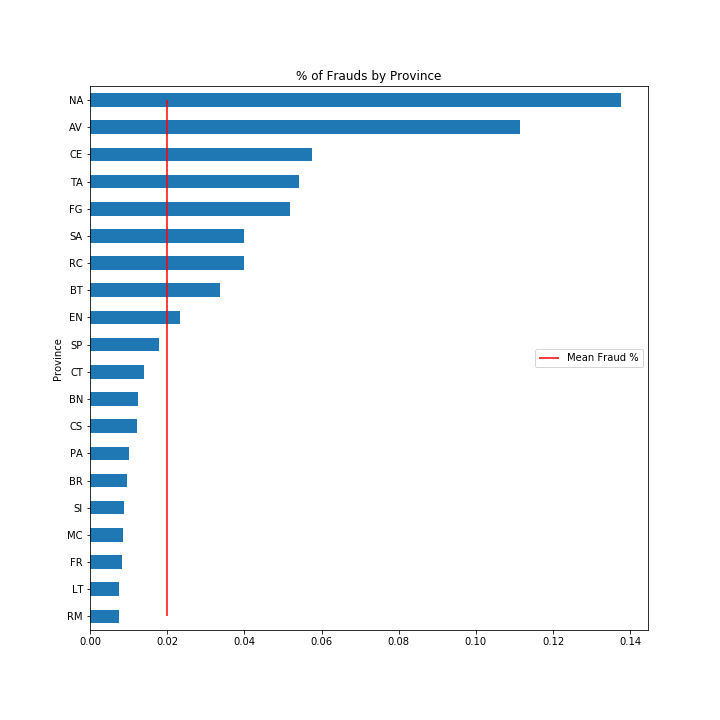

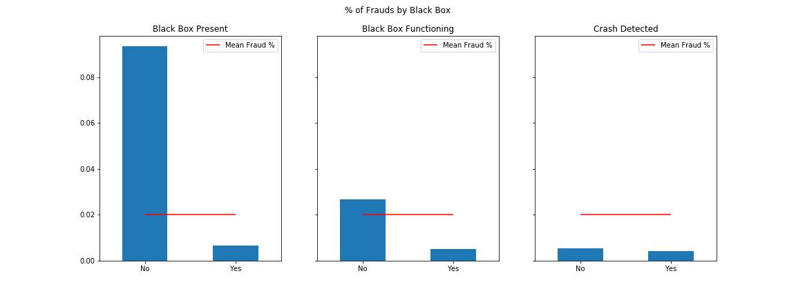

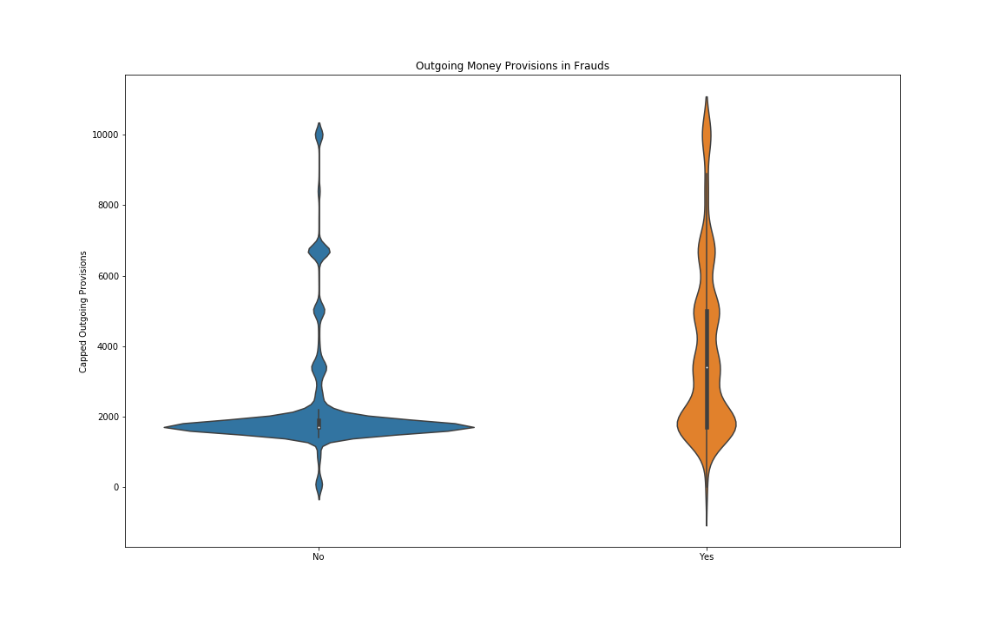

and among some derived features (difference between filing date and accident date, policy start and end date and month of filing)

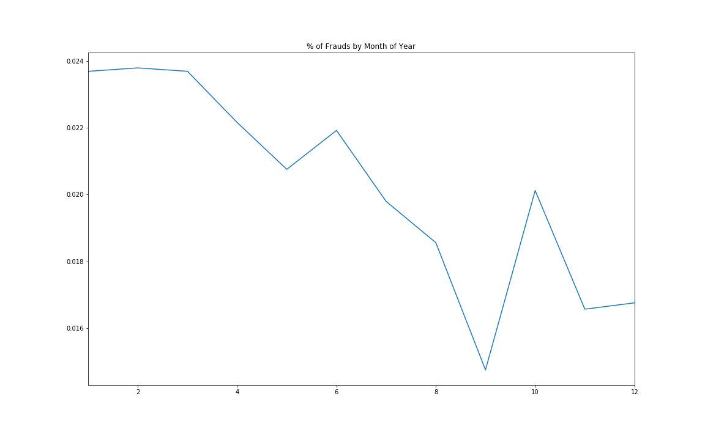

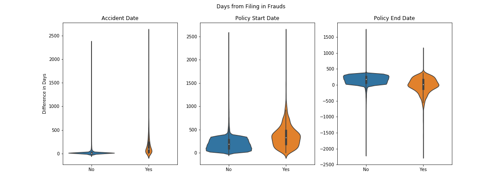

In this phase I found out that for most of the features some of the values presented a higher incidence of frauds and I chose to drop the features that seemed less promising in this sense: difference between filing date and policy start or end date and presence of a crash detected by the box. For the moment being I chose to kept the province, even though it may introduce some bias in my model.

## Network Analysis

My strong assumption about frauds is that they can be spotted by looking at the parties involved: if you commit insurance fraud it is very likely, in my opinion, that it is not a one shot thing but a recurrent behaviour.

Following this hypothesis I have created a network linking parties involved in a claim (car drivers and owners) between them if they have been in a car accident together. My idea leads naturally to consider a node having a lot of edges as bearing a higher risk of fraudolent behaviour, but this isn't quite enough to distinguish just a bad driver from a dishonest one; so I tried to find all the cycles in the graph, supposing that they were indicative of strange situations: it would be very rare if three people had distinct car accidents with each other, in the same way it is uncommon that three random people know each other. Here's an example of such a situation:

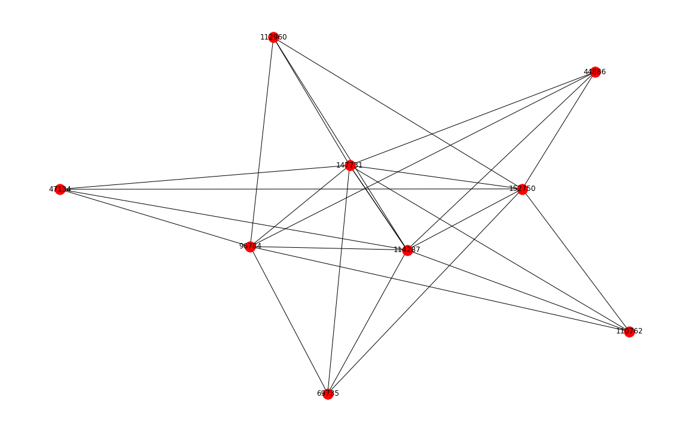

Using these inputs I implemented [PageRank](https://en.wikipedia.org/wiki/PageRank) in order to score the nodes in the graph, but since the original algorithm is designed for directed graph I used a version of it for undirected ones: this version involves the adjacency matrix $M$ of the graph and a weight vector $v$, and the algorithm calculates iteratively the ranking by solving

$$R(i + 1) = dM^TR(i) + (1 - d)v,$$

where $d$ is a real between 0 and 1 called damping factor and the rank $R$ is initialized as 1 over the number of nodes in the graph. Interestingly, if the weights are initialized in the same way as $R$ the algorithm result is equal to the degree centrality; but this doesn't hold true for other choices of weights.

In my implementation I used as weights the number of incident edges of a node plus the number of cycles the node is in. These gave a result similar to degree centrality but slightly tweaked in favor of nodes on cycles.

Using this values I scored the claims using the mean of the scores of the parties involved. Then I repeated this process for two other networks: one using the lawyers involved in claims and the other using the witnesses. In both cases I linked them to the car owners and drivers and I propagated the scores previously obtained, again using the undirected version of PageRank.

This process resulted in three different scores for the claims, which I used in the next phase to label them as frauds.

## Modeling

I tried a handful of different models to predict whether a claim is a fraud:

- random forest with all features
- random forest without province feature
- stacking of random forests with different input features
- anomaly detection methods: KMeans clustering and Local Outlier Factor

I used 5-fold cross-validation to tune all the models and compared their cross-validated scores to determine the best one. Since I used anomaly detection models to predict a label I had to build from scratch the k-fold cross-validation algorithm.

## Final Model

After training all the models I was left with the two random forests as best candidates, with very similar scores. Since, as I mentioned above, the province feature could introduce some bias based on the place of residence of the car owner (and since, moreover, this information is already used by insurance companies to determine the premium paid for a policy), I decided to go with the random forest without province.

I was glad to see that the scores I obtained from the networks were quite high in the forest's feature importances:

1. filing_diff importance: 0.24020
2. score importance: 0.20638
3. lawyer_score importance: 0.15382
4. filing_month importance: 0.08169
5. total_outgoing_provision importance: 0.06989
6. witness_score importance: 0.05275
7. accident_province importance: 0.05175
8. n_signatures importance: 0.02699
9. n_vehicles importance: 0.02344
10. black_box_active importance: 0.02176
11. n_people importance: 0.02073
12. card importance: 0.01767
13. rca importance: 0.01444
14. black_box importance: 0.01242
15. injury importance: 0.00608

The model, since the target variable was quite skewed, has almost perfect accuracy but a low recall; the final F1 score is 0.47.

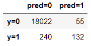

By looking at the precision-recall curve there seems to be some room for improving the recall without hurting too much the precision:

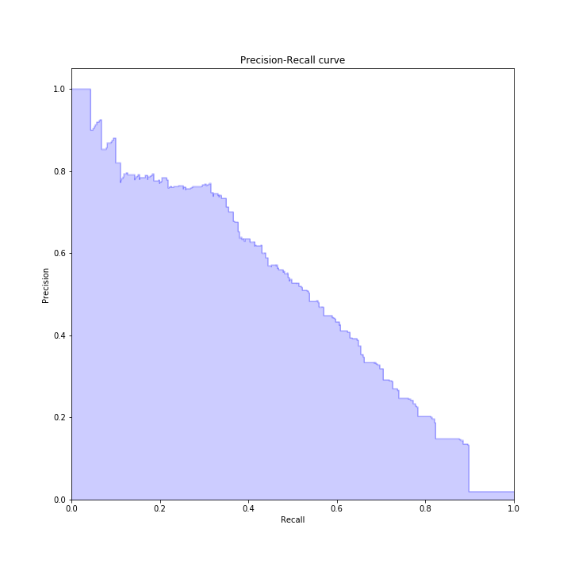

Finally, by looking at the fraud evaluation made by ANIA, which is the official evaluation made by the national association of all the insurance companies (sadly this evaluation is not available for all the claims, since it would have been a better target variable), I found out that my model score and the company one both fail to correctly label some of the false negatives (here `Frode acclarata` means proven frauds, `Nessuna frode` means no fraud and `Frode probabile` means probable fraud)

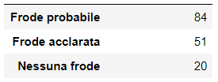

and false positives

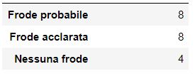

## Conclusions

In this project I tried to predict whether a claim is fraudolent analyzing network-like data obtained from the involvement of parties in claims. I learned a lot about graphs and rankings on them and I had fun trying out different techniques to label the claims, such as stacking and anomaly detection.

While the final F1 score of 0.47 isn't great I'm quite happy with it, given the difficulty of the task at hand; also, by looking at the false positives' and negatives' fraud evaluations, I found out that even if my score isn't perfect the same holds true for the company score, since some claims are mislabeled in both ways.

I think this score may be useful for the insurance company, if anything because it can give them another way to find fraudolent claims or suggest new directions to investigate. In addition I think this score may be of help to the people assessing frauds and could spare them some manual work, namely the research into parties involved in the claim.

## Further Analysis

Things I could have tried if I had more time:

- Find some absolute ground truth, since the score I used as a target variable is a company score, so it is obviously biased.
- Try some other values for the threshold of my model and compare how false positives and negatives behave.
- Find out if it is possible to get network-like data for all the claims in Italy, since using only data from one company makes my network incomplete.

## Code information

Feel free to browse the Jupyter notebooks in this repository. I used standard Python packages and visualization libraries.
