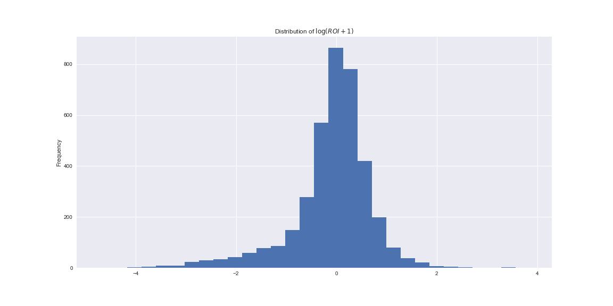
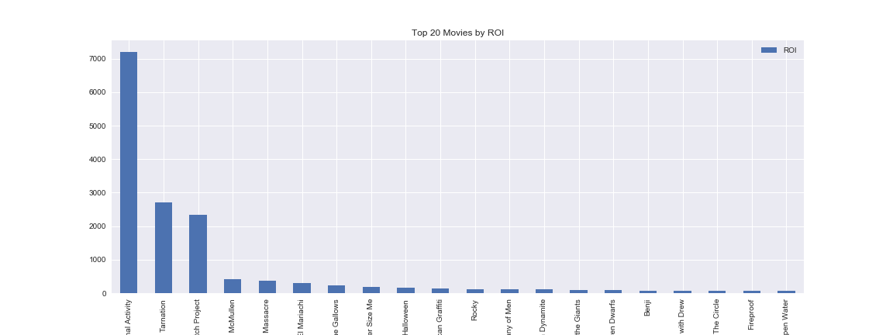
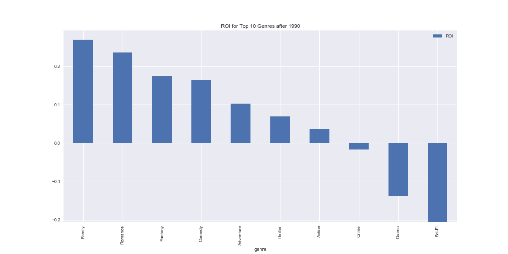

# EDA Project

## Goals

We want to determine what factors make a movie financially successful, whether it is a question of genre and/or actors and directors taking part in the movie or whether the movie rating sites play a role in making a movie successful (or, as it has been said for example [here](http://www.hollywoodreporter.com/news/studios-fight-back-withering-rotten-tomatoes-scores-1025575), *unsuccessful*).

## Initial Data Cleaning Approach and Exploratory Findings

We examined the dataset available on [this](https://www.kaggle.com/deepmatrix/imdb-5000-movie-dataset) Kaggle competition, containing data about the movies (director, main actors, genres and so on) and data about the ratings on imdb (number of reviews, rating...).

First, we had to clean the data from duplicated movies: we did so by using the link to the imdb movie page as a unique identifier. In this phase we also filtered out short movies and TV shows and series.

Then we asked ourselves how to measure the financial success of a movie using the gross revenue and budget data. In the Kaggle page it was pointed out that the amounts are in various currencies; moreover the value of a currency changes in time: to circumvent this problem we chose to use [return of investment (ROI)](https://en.wikipedia.org/wiki/Return_on_investment) to measure the success of a movie.

From the distribution of the ROI we can see that more than 25% of the movies are in the red.

Moreover, the top movies by ROI tend to be low budget ones.

At this point we were able to analyze the success of a movie in relation with imdb ratings' data; we found out that there is a very low correlation between ratings and ROI.

Finally, we added a column for each genre to the dataset in order to be able to compare ROI across genres. For the genres with more movies we found that, in the last 25 years, movies classified as either romance or family have a highest ROI.

## Initial Research Findings

1. *Budget type*: we found out that the best movies in terms of ROI are low budget ones, it may be beneficial to categorize the movies by [budget type](https://stephenfollows.com/average-budget-low-micro-budget-film/).
2. *Gross revenues and budget*: by looking at a few examples we found out that the amounts related to movies were not always precise; moreover the gross in the dataset refer to USA revenues and not worldwide ones.
3. *Ratings relation with ROI*: we found out that there is low correlation between imdb ratings and ROI, we could try a more complex measure of movies' approval combining imdb data.

## Further Research and Analysis

1. Add ratings from other movie sites (the [imdb API](http://www.omdbapi.com/) returns some of them) and more data about the movies, such as release date, DVD release date and so on.
2. Search more precise amounts for gross and budget and, if possible, for more detailed data ([this site](http://www.the-numbers.com/movie/budgets/all/1) may be helpful).
3. Analyze data by actors and directors and by combinations of genres.
