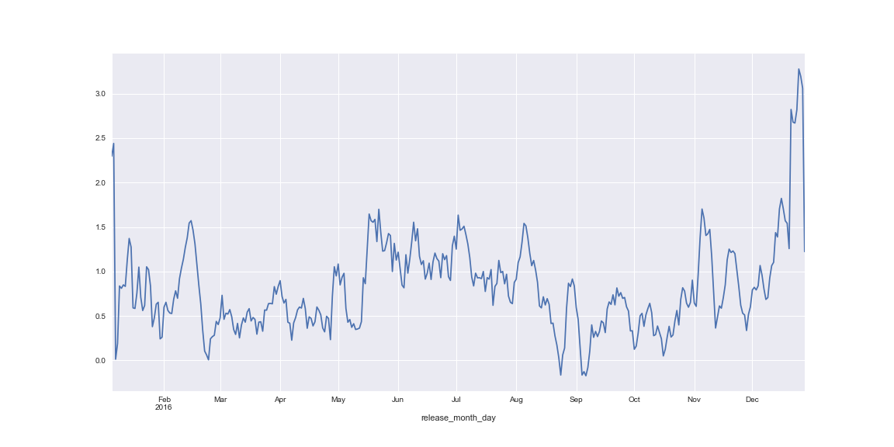

# IMDB Data Project

## Goals

This is an open-ended project for the [K2 Data Science Program](http://www.k2datascience.com/). The goal of the project is to find out if the commercial success of a movie is related to the ratings it gets on [IMDB](http://www.imdb.com/) (see for example this [article](http://www.hollywoodreporter.com/news/studios-fight-back-withering-rotten-tomatoes-scores-1025575)) or if it is only a question of genre and/or actors/director.

The dataset that has been used for the initial analysis is from a Kaggle competition and it can be found [here](https://www.kaggle.com/deepmatrix/imdb-5000-movie-dataset); the initial EDA has been wrapped up in [this MVP](https://github.com/aleph314/Projects/blob/master/EDA/MVP.md).

## Assumptions

We focused our analysis on feature-length movies released after 2000 and we excluded micro- and low-budget movies. In our opinion this is coherent with the idea of finding a relation between financial success and online ratings for two reasons:

1. The movies that typically try to be financially successful does not have a low budget and
2. online ratings started with the expansion of the internet, so the new millennium seems a good cut.

## Approach

We used the [ROI](https://en.wikipedia.org/wiki/Return_on_investment), calculated using production budget and worldwide gross revenues, to measure the success of a movie; furthermore, after the preliminary analysis, we decided to categorize the ROI using five bins, from "very low" to "excellent".

We used the same measure to evaluate the success of a single actor or director across all the movies s/he took part and found out who the best actors

and directors

by ROI are.

## Cleaning the Data

*Please refer to the [imdb_data_cleaning.ipynb](1_imdb_data_cleaning.ipynb) Jupyter notebook.*

The original dataset had some duplicates which we dropped in the initial data cleaning. Moreover, we dropped all the rows relating to TV movies, shows and series, all the short movies and all the movies for which the gross data was missing.

We then added the ROI column and split the genres into several columns, one for each genre with a flag indicating whether the given genre applies to the movie.

## Getting New Data

*Please refer to the [budget_gross_scraping.ipynb](2_budget_gross_scraping.ipynb) and the [budget_gross_EDA.ipynb](3_budget_gross_EDA.ipynb) Jupyter notebooks.*

We knew a priori that we would have to account for some discrepancies in the amounts in the dataset, such as different currencies or amounts from different epochs. What we discovered during the data cleaning however was that we had some imprecisions in the data:

1. Imprecise budgets: by looking at some movies on IMDB we found out that the budget amount differed from the one reported in the dataset.
2. Local revenues: the dataset accounted only for local and not worldwide revenues, changing quite a bit the success of certain movies.

Thus, we scraped [this site](http://www.the-numbers.com/movie/budgets/all/1) for more precise numbers and adjusted them to 2016 dollars in order to distinguish between the type of budgets of a movie through different years.

After this, we took a look at the top non micro- or low-budget movies by worldwide ROI

and plotted some time series to search for seasonality in the data

finding, not surprisingly, that movies released in the holidays tend to have better performances.

## Findings

*Please refer to the [imdb_budget_join.ipynb](4_imdb_budget_join.ipynb) and the [imdb_EDA.ipynb](5_imdb_EDA.ipynb) Jupyter notebooks.*

In order to answer our initial questions we added this new data to the initial dataset.

We had some duplicate names in the scraped data, so we had to compare the release year and the production year to join the two datasets. We also had to manually match a few hundred of movies that were spelled differently or in different languages.

Finally, we binned also the IMDB ratings and the worldwide ROI in a manner similar to the one described above and performed chi-square tests to investigate the relations between the (binned) movie financial success and

- Actors' financial success (binned)
- Directors' financial success (binned)
- Genres
- IMDB ratings

finding very low p-values that suggested that all of the above are related.

In particular, we found that using this analysis method ratings and movies' success are related, in contrast with what we found out using non-binned ratings and ROI.

## Lessons Learned

In contrast with my first impression of ratings not being related to financial success, using a different approach I found out that there is a relation between them: the lesson learned here is that it is worth diving deeper into an analysis and trying different approaches before drawing any conclusion.

## Further Analysis

What we would have done further if we had more time and data:

1. Add some data about actors and directors, such as sex and age or their medium pay.
2. Add data about the movies' DVD release dates, initial week revenues and more.
3. Analyze ratings from other websites.
4. Analyze the effectiveness of combination of genres in relation to the financial success of a movie.
5. Determine if the analysis of the binned quantities is more precise than the one performed in the preliminary EDA.
6. Determine which variable influences the other, e.g. if the ratings influences the success of a movie or if it is the other way round or a bit of both.
