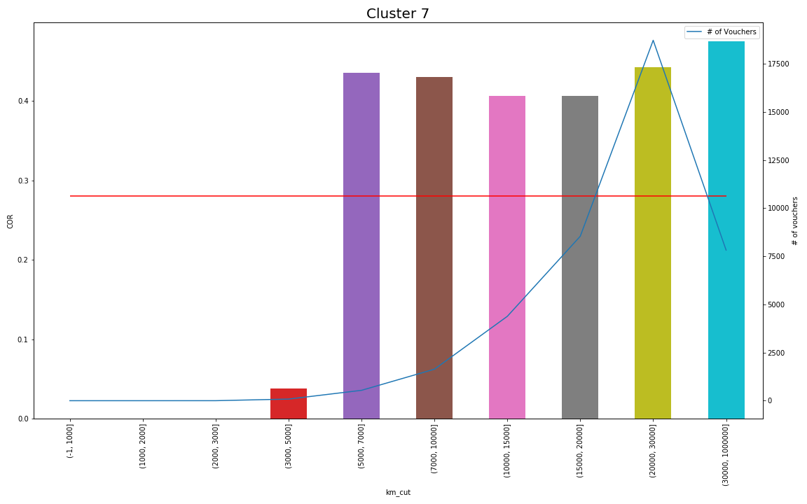

# Black Box Data Analysis

Since the advent of IoT devices a lot of data has been available to companies in many businesses. In this project I will focus on cars' black boxes' data that is sent daily to an insurance company: these data contains information about daily distances traveled by clients, split by type of road traveled (i.e. higways, city streets...).

My main goal is to find a way of clustering clients based on the way they use the car by means of these daily distances: this type of analysis may have value in supporting the insurance company in the detection of riskier clients' behaviours and in the determination of premium amounts.

## Methodology

I decided to use apriori algorithm to mine frequent patterns in the daily distances travelled by clients that, in turn, become features for a clustering.

[Apriori](https://en.wikipedia.org/wiki/Apriori_algorithm) is an iterative procedure that finds larger and larger item sets that appear frequently in a dataset: in the first iteration it finds the set $L_1$ of the item sets of length 1 such that they appear more times than a given threshold; then it proceeds using the set $L_{k-1}$ of frequent item sets of length $k-1$ to form item sets of length $k$ satisfying the condition that no subset of length $k-1$ is not contained in $L_{k-1}$; the procedure keeps on going until there is at least 1 frequent item set of length $k$.

In this project I applied apriori to the daily mileages of an insurance annuality, representing them as a sequence of letters, one for each day representing a given range of kilometers (e.g. the string EBB stands for one day with a mileage between 30 and 40 km and two with 0 to 10 km traveled): I used the algorithm to mine frequent patterns of *consecutive letters* in each sequence by looking at all the patterns in all the sequences. I then transformed this frequent patterns into features by counting the number of occurrences in the sequences for each of them.

I also extracted data about the time series that each annuality naturally is (such as mean, median, minimum...) and tried to add it to the clustering algorithm.

A sketch of the whole analysis can be found in this [notebook](0-10000-Clients-Analysis.ipynb), where I deal with a small subset of the whole dataset.

## Data Cleaning and Initial EDA

The data used for this analysis contains daily information for each black box, but each one of them can cover many years of insurance for a given client: in order to analyze the data from a common standpoint I have treated each insurance annuality separately and I have discarded all the annualities containing less than 100 days of data (these may be due to missing data or clients that canceled their insurance policies). I also dropped the annualities with more than 365 days of data and that with missing days.

I tried two different binnings of the data:

1. arbitrary ranges (0, 0-10, 10-20, ...)
2. ranges determined by quantiles (0-29%, 29-50%, ...)

To this features I also added some measures calculated for each time series:
- mean
- median
- standard deviation
- 25th quantiles
- 75th quantiles
- minimum
- maximum
- sum
- count
- count of days with zero km travelled

Since the dataset was fairly big I used [Google BigQuery](https://cloud.google.com/bigquery/) and [Cloud Datalab](https://cloud.google.com/datalab/) to accomplish this first part of cleaning and analysis (the BigQuery queries I used are [here](data/raw/queries)); you can find the code used in the notebooks about [data cleaning](1-Data-Ingestion-and-Cleaning.ipynb) and [EDA](2-EDA-and-Feature-Extraction.ipynb).

## Clustering

In order to cluster the insurance annualities I mined frequent patterns using apriori (see this [notebook](3-Apriori.ipynb)) and added them as features by counting the number of occurrences of patterns of length between three and seven letters. Then I normalized this features using [tf-idf](https://en.wikipedia.org/wiki/Tf-idf), a numerical statistic frequently used in text mining that weights the time a word appears in a document and its frequency in the entire corpus, where in my case the words are the found patterns, the document is a single annuality and the corpus is all the dataset.

I also added the features obtained from time series' statistics and scaled them in order to have comparable units to the ones used for apriori features after tf-idf.

After pre-processing the data in such a way I ended up with four different datasets (with arbitrary or quantiles' ranges, with or without time series' statistics), and I used k-means on all of them with 10 as the number of clusters, which I determined inspecting the inertia for different numbers of clusters on a subset of the data (see this [notebook](0-10000-Clients-Analysis.ipynb)).

Since the clusterings were done on dataset of over 5GBs I ran the code on [Cloud Datalab](https://cloud.google.com/datalab/), retrieving data from [Google Cloud Storage Buckets](https://cloud.google.com/storage/docs/json_api/v1/buckets), in order to be able to execute the algorithm (you can find the code in this [notebook](4a-Clustering-on-Cloud)).

Finally I tried to determine which of the clusterings works best. To do so I computed the [COR](https://www.investopedia.com/terms/c/combinedratio.asp), or combined ratio, a measure used in insurances to compare money spent in claims' management against money gained with premiums: my objective was to find a clustering that tended to put detrimental clients in the same clusters, that is to find one or more clusters for which the COR was way above the overall COR.

The clustering that turned out to be the best was the one using ranges determined from quantiles

for which clusters 7 and 5 seem to fit my intended goal.

## Results

As a last step I tried to interpret the clusters and determine the type of information that I could extract from them (see this [notebook](5-Interpreting-Clusters)).

First, I looked at the clusters' centroids to get a feeling of the type of driving behaviour each of them represents:

For example clusters 5 and 7 client type seem to be of people that travel a lot every day (maybe long distance commuters), with a higher average for cluster 7; while cluster 6 seems to represent people who use the car just some day (such as the weekends) and cluster 8 people who travel short distances daily (maybe people who work in the same city where they live and move by car) with some quite well distributed peaks (that may coincide with weekends).

Then I looked at the difference between my clustering and one obtained by grouping annualities by total mileage: this comparison stems from looking at the average total mileage of annualities in each cluster, which is higher for clusters with higher CORs. This seems obvious, so I wanted to see if my clustering gives some new information or if it is the same as a mere grouping by total mileage.

In order to do so I looked at the COR of the groups by total mileage

and I confronted it with the same groups for cluster number 7

There are some useful observations that can be done by looking at these plots:

1. grouping annualities by mileage creates groups with increasing CORs, as expected,
2. also as expected: this groups contains less and less annualities as the total mileage increases,
3. even though the average total mileage of cluster 7 is high (23,000 km), from the second plot it's clear that the COR is high across all mileages,
4. more so: the CORs for almost all the ranges in cluster 7 are higher than their counterparts in the grouping by mileage.

All this seems to indicate that the clustering identifies the annualities with high CORs indipendently of the total mileage, thus giving useful insights on the clients' behaviours.

Finally I checked if there are some differences among the clusters in terms of claims number and type of claims (i.e. different type of complaints, such as theft, car accidents...). The results are summarized in the plots below, that show the distributions of the total number of claims in an annuality and the number of claims by type, comparing the overall distributions with those of each cluster.

In both cases there are some differences between the distributions, but they don't seem too marked to be indicative of something profound.

## Conclusions

In this project I analyzed daily mileages for over 600,000 car insurance annualities using NLP techniques, apriori and clustering.

The goal of this analisys was to identify "better" and "worst" groups of clients for the insurance company; to do so I used a measure called COR which is the ratio between the claims' cost and the premiums paid and I found out some promising clusters with respect to it: the data is suggesting that the clustering is adding some value with respect to simpler ways of assessing the risk for a client, such as using the total mileage of the insurance annuality.

As a last really inaccurate experiment I tried to estimate how much the company might gain by varying the premium for some of the clusters with a higher COR: for example a 5% increase for clusters 5 and 7 gives an improvement of 0.002, which in turns corresponds to 750,000€. As i said this is far from precise but gives an idea of the value the clustering might have for the company.

## Further Analysis

If I had more time I would have tried:

- try to find anomalous annualities and/or analyze the annualities that are in a bad cluster but have no claims and, viceversa, the annualities in good clusters that have a claim
- further analyze the daily mileages and try to predict the probability of having a car accident
- do the premium increase experiment more rigourously, for example using Monte Carlo simulations
