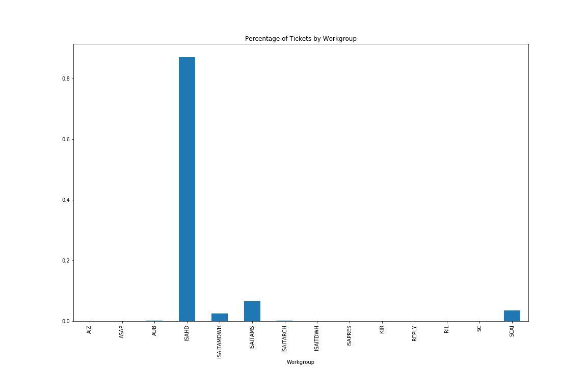
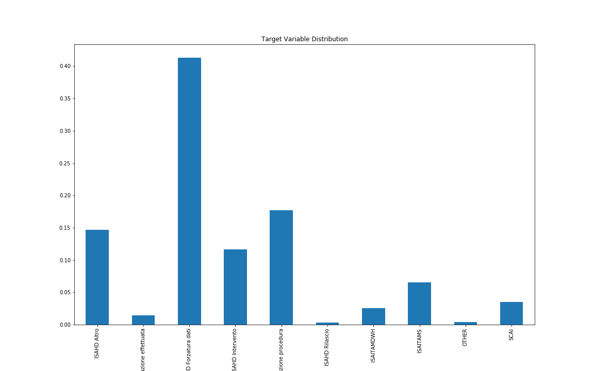
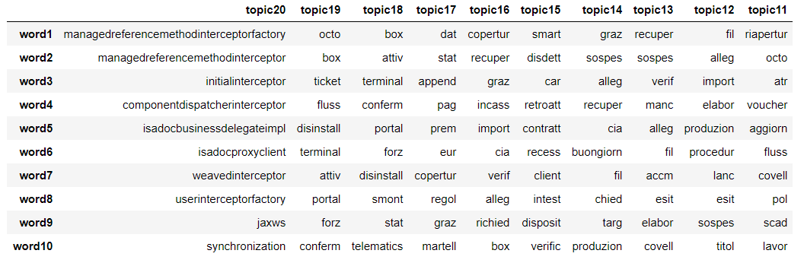
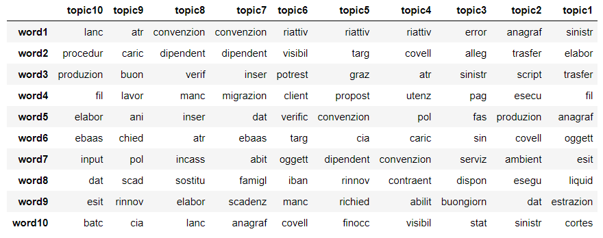
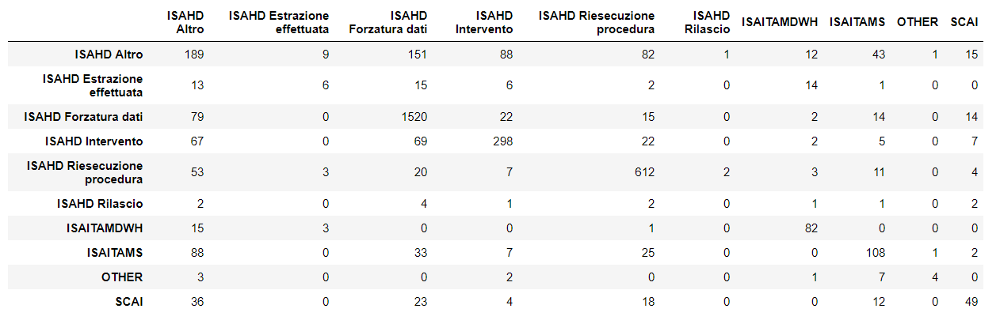

# IT Tickets Classification Project

The goal of this project is to use NLP to analyze IT tickets in order to understand how to channel them for a correct resolution.

The first advantage of such a project is to pre-sort tickets for the IT structure dedicated to this task, speeding up their work; a second and more ambitious goal could be the possibility to create a processo to assign automatically tickets to the correct workgroups.

## Data Collection

The data used in this project comes from [JIRA](https://www.atlassian.com/software/jira), a software that can be used to manage requests workflow. I got the data of the issues opened toward a company IT querying JIRA's [REST API](https://developer.atlassian.com/cloud/jira/platform/rest/) with a `GET` request.

I collected some basic data about tickets created during the 2017:

- ticket key
- date of the request and name of the applicant
- issue type
- ticket's summary and description
- eventual ticket's type of resolution and/or workgroup assignment

## Data Cleaning and EDA

After collecting the data I cleaned the tickets' summary and description features using regex to eliminate http and network addresses, emails, dates and words containing both letters and digits; then I manually inspected all the words starting with a capital letter in order to find out all the personal names and ignore them too. After this first round of data cleaning I created a bag of words for each ticket, ignoring italian stop-words and stemming all the terms.

As a last preliminary step I tried to create a sensible target variable: first I determined the workgroup that managed the issue, and found out that most of them were assigned to ISAHD group.

Many of the other workgroups have very few tickets assigned to them, so I grouped them in one category. Moreover, since ISAHD, beside dealing with their own issues, is also the workgroup in charge of channeling the tickets toward other groups, I decided to expand their ticket labeling using issues' type of solutions. This seemed to make sense because it could help them know whether an issue has to be forwarded to another group or, in case they need to solve the issue themselves, what type of resolution is requested.

## Topic Modeling

I decided to analyze the tickets' textual data using topic modeling. In order to do so I created a document-term matrix from the tickets' bag of words, discarding all the words that appeared in all the tickets or just once.

After this preliminary step I performed topic modeling using SVD after normalizing the matrix using TF-IDF. I selected the first 20 eigenvalues, corresponding to the 20 most relevant topics:

Looking at the 10 most relevant words of each topic I could identify some patterns:

- technical terms (topic 20)
- agreements terminology (e.g. topic 16, 15 and 8)
- suppliers management (e.g. topic 19, 18 and 11)
- IT procedures (e.g. topic 12 and 11)

## Random Forest Model

I used the topics obtained before to train a random forest model and predict the class labels. I tried three different models using the most relevant 10, 15 and 20 topics respectively, tuning each of them using 5-fold cross-validation and determining the best model comparing the cross-validation F1 scores.

The model I ended up choosing was the one with all the 20 topics, which gave me a test F1 score of almost 0.7.

By inspecting the confusion matrix I noticed that the model is not very precise in determining some of the labels:

- "ISAHD Altro", a quite generic label that it's confused with many other issues' categories,
- "OTHER", "ISAHD Rilascio", "ISAHD Estrazione effettuata" and some of the other least numerous categories.

## Conclusions

In this project I used some NLP techniques to analyze textual data about incoming IT requests, using topic modeling to try and predict how an issues has to be addressed in order to correctly solve it. Since there are a lot of ways to solve an issue this is a multi-class prediction, in which some of the classes are very difficult to predict correctly since they occur rarely.

The final F1 score is near 0.7, which leaves room for improvement for sure: I could be more precise in eliminating noise words and try to collect more issues in order to have more data for the least frequent categories.

## Further Analysis

If I had more time I would have tried:

- to add more topics to my dataset
- to determine a list of words inherent to the language used in requesting something (such as greetings, thanking and so on)
- to see how the predictions change by adding the name of the person who created the ticket

## Code information

Feel free to browse the Jupyter notebooks in this repository. I used standard Python packages and visualization libraries.
