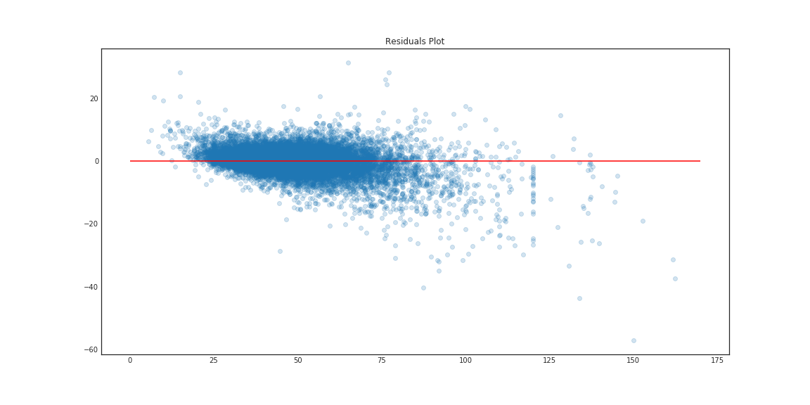

# Energy Price Prediction Project

## Introduction

[Energy market in Italy](https://en.wikipedia.org/wiki/Italian_Power_Exchange) takes place every day in order to determine the energy price (**PUN**) for the subsequent day.

The PUN is determined as the balance between the supply and demand subject to some conditions on the transit of energy between different zones of Italy and between Italy and neighboring countries.

The aim of this project is to predict the energy price starting from the publicly available data on the [energy market's managing institution (GME)](http://www.mercatoelettrico.org/It/default.aspx). Reliable price predictions are very useful to energy producers for two reasons

1. it allows them to sell their energy at the best possible price and
2. it avoids for them not to succeed in the selling, incurring in the possibility of having to dissipate their energy with all the related costs.

## Data

I used the following publicly available datasets from GME

- **Prices**: PUN throughout the years.
- **Demand**: estimates of the energy need for each zone in Italy and for the whole country.
- **Transit**: limits of energy exchange between neighboring zones in Italy and between Italy and neighboring countries.
- **Gas price**: gas prices for the next few days from the gas market.

I added weather data in the form of [heating and cooling degree days](http://www.degreedays.net/), which measures how much and for how long air temperature was lower or higher than a base temperature (I used the standard temperatures of, respectively, 15°C and 18°C).

I also looked into energy futures from the [italian stock exchange](http://www.borsaitaliana.it/borsaitaliana/statistiche/mercati/commodities/commodities.htm), but later decided not to use them because I didn't have enough domain knowledge to understand how to use them.

## Exploratory Data Analysis

After merging all the datasets together I looked at features correlation

finding positive correlation between PUN and demand and negative correlation between PUN and transit limits.

Then I looked at the relation between PUN and time-related features:

I found out that the PUN is higher in winter months and in July, lower in the weekends and that it has a bivariate distribution across the day.

The PUN also seemed to change according to the weather data, as shown here using data from three different weather stations:

Finally, I tried to model the variations in wider time periods using a rolling mean over the last 30 days:

## Feature Engineering

Following the discoveries in the first round of EDA I thought of adding features for:

- PUN moving average over the last 30 days
- hours
- months
- weekdays

In a manner similar to the moving average over the last 30 days I tried to model the value of the PUN across the same hour in the last period using a moving average for the same hour over the last 7 days

I also added a variable representing italian holidays (since weekends presented lower prices I thought that national holidays may too); although it seems that there isn't much difference.

I then tried to summarize some of the low level information about time

and looked at the differences between peakload, which are defined by GME as the hours between 8 and 20, and non-peakload hours:

Based on this findings I decided to add some other features representing

- winter months (January + October + November + December),
- evening hours (from 19 to 22),
- morning hours (from 8 to 11) and
- weekends.

## Modeling

The first model I tried is a random forest trained on the full dataset after feature selection using RFE. After tuning the model I got a validation R-squared of 91% and a mean absolute error of 2.90€, which was a very good baseline to improve upon.

I then decided to drop some variables that seemed redundant (such as hours, months and weekdays dummy variables) and tuned a new random forest which gave me a slightly improved mean absolute error of 2.72€.

At this time I thought about trying some other models, so I tried out SVM and modeling each hour by itself: SVM was great on the training set, with a MAE of 0.10€, but it grossly overfitted the data and had a validation error of over 10€. For the hourly model instead I used random forests, but each of the models was worst than the forest on all the data.

I then tried boosting my best model so far, the second forest, and got a very good result after tuning the gradient boosting: a validation R-squared of almost 93% and a MAE of 2.58€.

As a last attempt I decided to add more data to my model by renouncing at the weather variables (which I had only for a part of 2014), but I found out that this model wasn't as good as the previous ones.

## Conclusions

Boosted random forest is the best model among the ones I tried: even if it seems to overfit a bit the training set it achieves very good validation errors and a test MAE of 2.56€, which is actually a bit better than the validation error!

I have seen that discarding variables in order to get more data isn't useful, probably because the added value of some of the dropped columns is high (I think the weather data is mainly responsible for this) - it could still be useful though to get more training data if I wouldn't have to drop variables.

I have also concluded that trying to predict the PUN for each hour separately produces worst results than training on all the data at once.

## Further Analysis

If I had more time I would have tried to

- explore the dataset trying to find the cause of the patterns in all my residuals plots,
- try to find other features in order to reduce this patterns
- and do more fine tuning of my best models.

I would have also liked to try out my model collecting daily data and trying to predict the prices for the following day.

## Code information

Feel free to browse the Jupyter notebooks in this repository. I used standard Python packages and visualization libraries. Raw, preprocessed and processed data can be found in the data directory.
