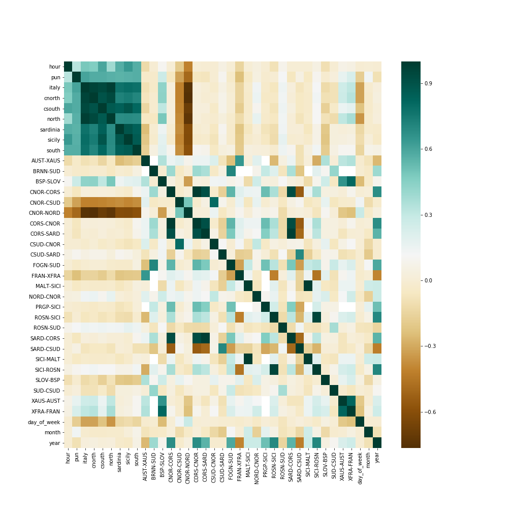
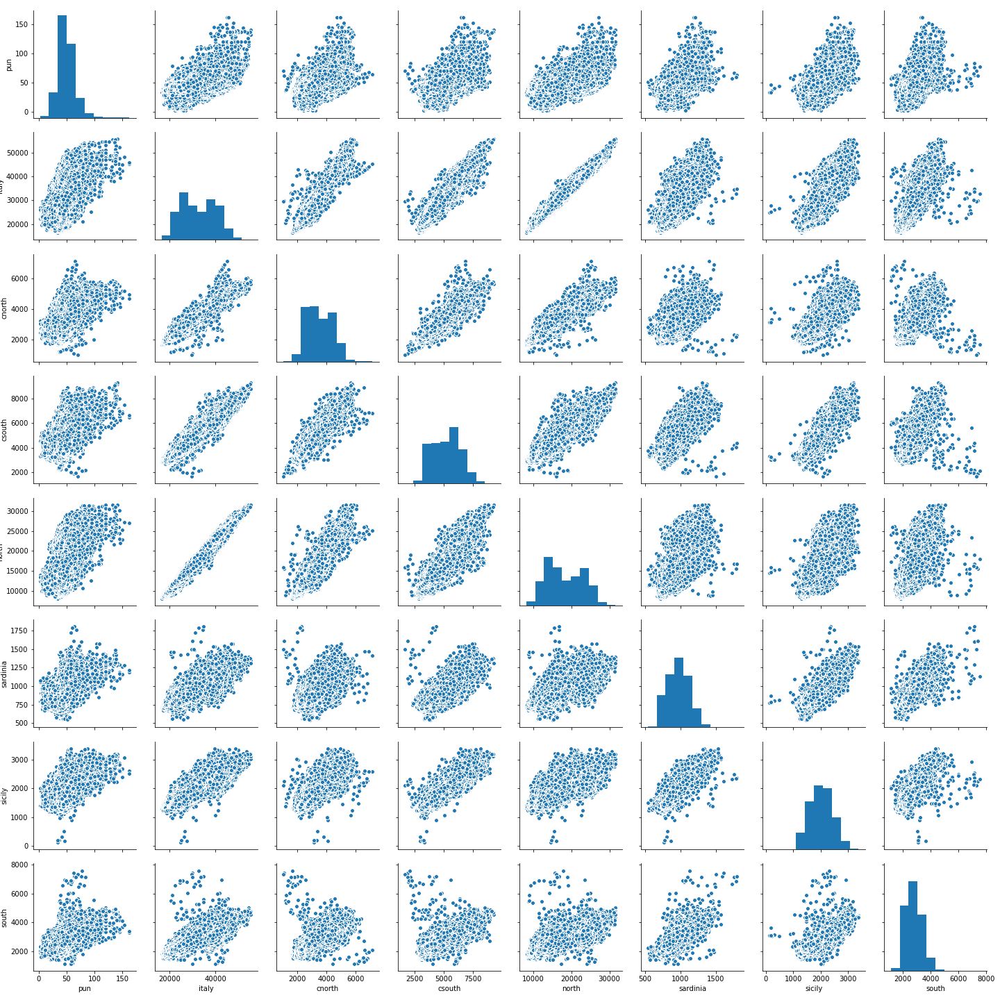
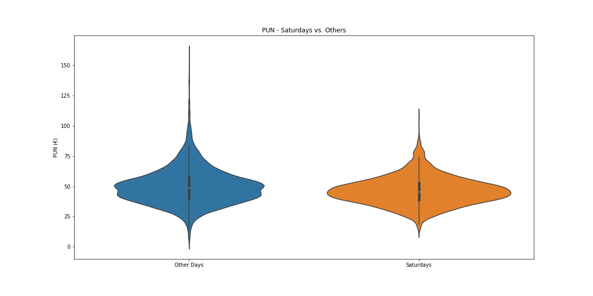
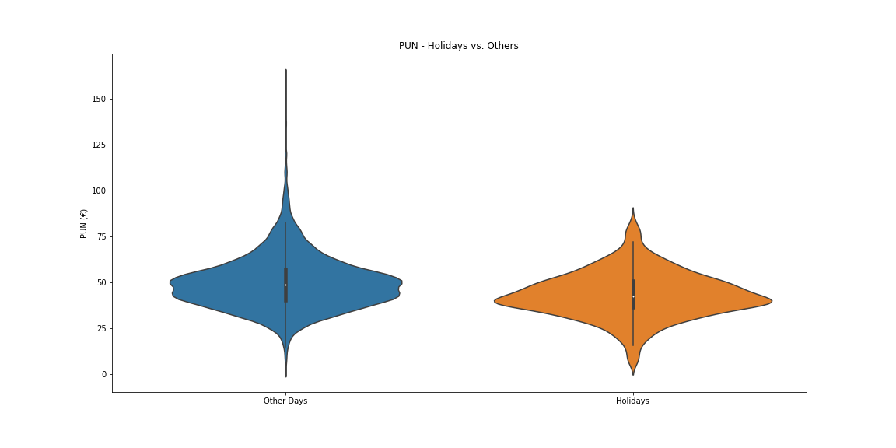
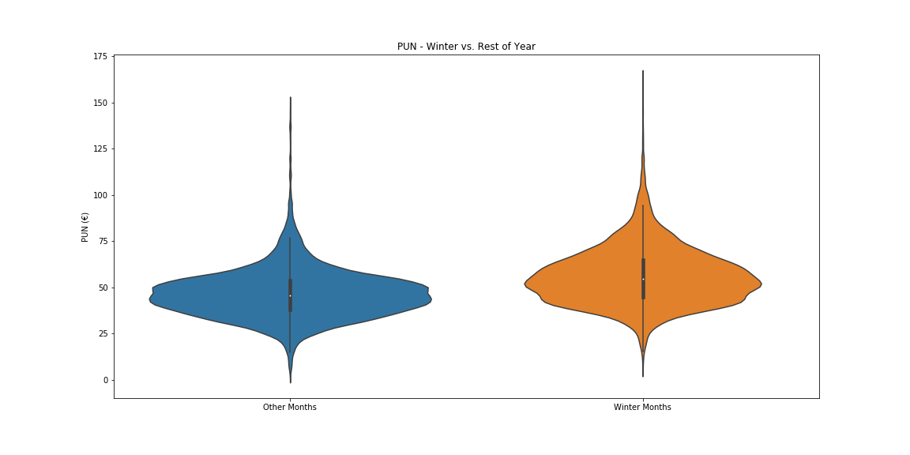
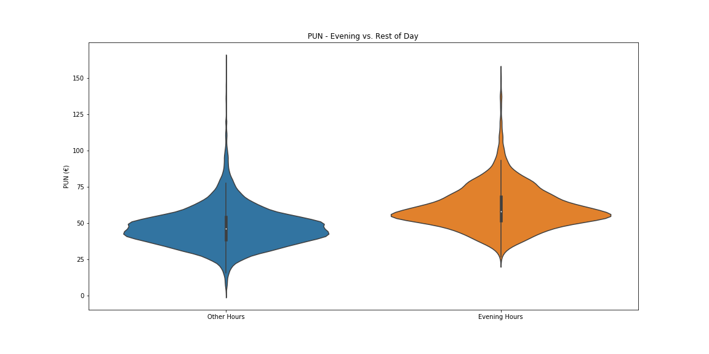
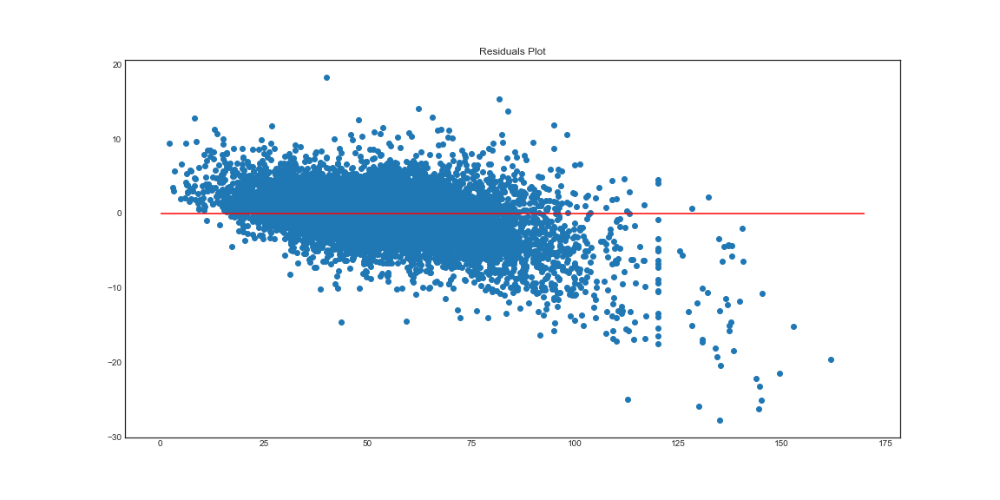

# Energy Price Prediction Project MVP

## Goals

[Energy market in Italy](https://en.wikipedia.org/wiki/Italian_Power_Exchange) takes place every day in order to determine the energy price (**PUN**) for the subsequent day.

The PUN is determined as the balance between the supply and demand subject to some conditions on the transit of energy between different zones of Italy and between Italy and neighboring countries.

The aim of this project is to predict the energy price starting from the publicly available data on the [energy market's managing institution (GME)](http://www.mercatoelettrico.org/It/default.aspx). Reliable price predictions are very useful to energy producers for two reasons

1. it allows them to sell their energy at the best possible price and
2. it avoids for them not to succeed in the selling, incurring in the possibility of having to dissipate their energy with all the related costs.

## Initial Data Cleaning Approach and Exploratory Findings

I used data from the beginning of 2014 to October 2017 from three different data sources:

- **Prices** (one row per day and hour): PUN throughout the years.
- **Demand** (one row per day and hour): estimates of the energy need for each zone in Italy and for the whole country.
- **Transit** (one row per day, hour, zone of origin and zone of destination): limits of energy exchange between neighboring zones in Italy and between Italy and neighboring countries.

First of all I joined all the data in one dataset with a row per day and hour; then I added variables for the day of week, month and year and dropped some transit columns which yielded no additional information.

I find out that there were a slight correlation between the PUN and the transit columns

and that the demand data presented correlation between the various zones

By examining the distribution of the PUN across the time-related variables I added I thought of adding some dummy variables for saturdays, sundays and holidays

for winter months

and for evening hours

## Initial model

Using all of these new variables I decided to fit a random forest regression model to the data. After a grid search to find the best parameters the model yielded a training R-squared of 97.5% and a mean absolute error of 1.54€. In order to get a better sense of what this absolute error means in terms of predicting the PUN I also calculated the percentage error with respect to the mean PUN, which was 3%.

The model didn't perform this well on the test set, for which the R-squared was of 81% with an error percentage more than doubled at 8.5%.

An inspection of the residuals plot revealed a definite downward trend.

## Initial Research Findings

- PUN shows differences between the months in the year, days of the week and hours in the day
- The initial model doesn't capture all the data variance, as it is shown by the residuals plot

## Further Research and Analysis

- Investigate difference between years and try to incorporate it
- Try to get better predictions of the price peaks
- Add new features to get better predictions (a very good result would be a MAE of under 2€, an excellent one under 1€)
- Deeper EDA considering the time series aspect
- Add new data from other sources (e.g. weather forecasts)
